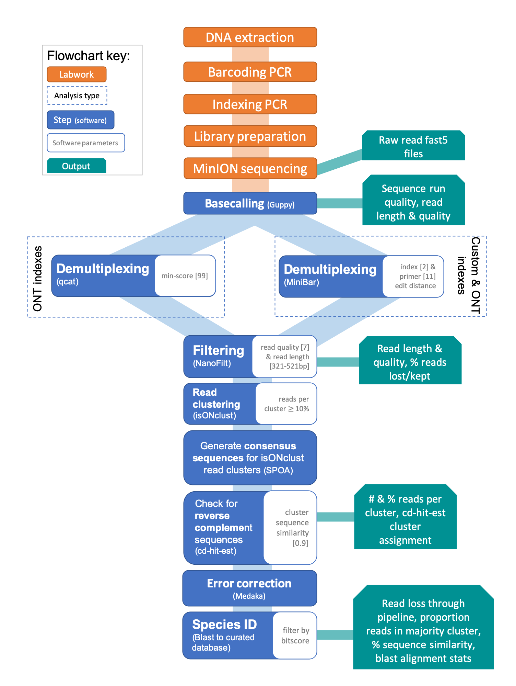

# SAIGA: A user-friendly DNA barcoding bioinformatics pipeline for MinION sequencing


The SAIGA pipeline was designed for processing and analyzing Oxford Nanopore Technologies (ONT) MinION DNA-barcoding sequence data. 

Our pipeline is called SAIGA to help bring awareness to conservation efforts for the Critically endangered Saiga (*Saiga tatarica*). Saiga populations are threatened by habitat loss and fragmentation, illegal wildlife trade (meat, horn), and disease. Consequently, in addition to population size crashes, the sex ratio has been skewed due to preferential hunting of males for their horns. Saiga horn is the primary component of several Traditional Chinese Medicines that claim to detox and treat colds and lung disease; however saiga horn has no scientifically recognized medicinal value <sup>1,2</sup>. As of 2019, the CITES Conference of Parties voted to keep saiga on the CITES Appendix II list, but there is now a zero quota for the international trade on wild saiga horn <sup>3</sup>.  

<sup>1</sup> https://china.wcs.org/Wildlife/Saiga-Antelope.aspx

<sup>2</sup> https://medium.com/@WCS/saving-the-saiga-6829a429abeb

<sup>3</sup> https://newsroom.wcs.org/News-Releases/articleType/ArticleView/articleId/12926/BREAKING-NEWS-From-CITES-CoP18-on-Saiga-Antelope.aspx

Saiga logo by Natalie Tam

### Saiga was developed for and accompanies the paper:
*"MinION-based DNA barcoding of preserved and non-invasively collected wildlife samples".*
Adeline Seah*, Marisa Lim*, Denise McAloose, Stefan Prost, Tracie Seimon

-------------



-------------
# Table of contents
1. [Dependencies](#Dependencies)
    1. [Software installation advice](#installadvice)
2. [Input files](#inputs)
3. [Choose parameters](#params)
4. [Usage: Run Saiga](#runpipe)
    1. [Demo data](#demo)
    2. [Your data](#yourdat)
5. [Pipeline output files](#outputs)

[top](#top)

## Software dependencies <a name="Dependencies"></a>
- Guppy v3.1.5+781ed575
- NanoPlot v1.21.0
- NanoFilt v2.5.0
- qcat v1.1.0
- MiniBar v0.21
- seqtk v1.3-r106
- isONclust v0.0.6
- spoa v3.0.1
- cd-hit-est v4.8.1
- medaka v0.10.0
- NCBI blast v2.8.1+

SAIGA scripts were written with Python3 and tested for MacOS. 

<a href="#top">Back to top</a>

### Software installation advice <a name="installadvice"></a>
One of the easiest ways to install python libraries and other software is to use conda install from Anaconda.
- Download Anaconda3: https://www.anaconda.com/distribution/. We want Anaconda3 so that it downloads Python3. Follow installation instructions from website.
- Once you have anaconda, configure the conda command to tell it where to look online for software. It does not matter what directory you’re in.
  - `conda config --add channels bioconda`
  - `conda config --add channels conda-forge`

Note that this pipeline assumes the following software are called via `source ~/.bashrc`:
  - guppy
  - qcat
  - MiniBar
  - seqtk
  - spoa
  - cd-hit
  - blast

#### Basecall: Guppy
https://community.nanoporetech.com/downloads

- I downloaded Mac OSX version
- `unzip ont-guppy-cpu_2.3.1_osx64.zip`
- Add guppy to bashrc path (`export PATH=$PATH:[your path]/ont-guppy-cpu/bin`)

#### Read filtering: Nanofilt
https://github.com/wdecoster/nanofilt

- `conda install -c bioconda nanofilt`
- Runs as `NanoFilt <flags>`
  - this was originally causing a problem before I added bioconda channel to conda

#### Read stats: NanoPlot
https://github.com/wdecoster/NanoPlot

- Download the zipped folder of the github repository from green button that says ‘Clone or download’
- Unzip folder: `unzip NanoPlot-master.zip`
- Set up NanoPlot:
  - `cd ./NanoPlot-master`
  - `python setup.py develop`
- Runs as `NanoPlot <inputs>`
- Alternatively, use pip or conda installation commands (the above is a work-around since pip and conda timed out for me)

#### Demultiplex: Qcat
https://github.com/nanoporetech/qcat

- follow qcat download instructions (I downloaded via `git clone` option (v1.1.0))
- Add qcat to bashrc path (`export PATH=$PATH:[your path]/qcat`)

#### Demultiplex: MiniBar
https://github.com/calacademy-research/minibar

- Download MiniBar: `curl https://raw.githubusercontent.com/calacademy-research/minibar/master/minibar.py`
- Permit execution of MiniBar’s python script: `chmod 775 minibar.py`
- minibar.py needs python library called edlib. Note that this differs from edlib, which is a command line version that works in Unix/Linux environment rather than Python.
  - `conda install -c bioconda python-edlib`
- Add MiniBar to bashrc path (`export PATH=$PATH:[your path]/MiniBar/`)

#### Generate data subsets: seqtk
https://github.com/lh3/seqtk

- follow github installation instructions
- Add to bashrc path (`export PATH=$PATH:[your path]/seqtk`)

#### Cluster reads: isONclust
https://github.com/ksahlin/isONclust

- download: `pip install isONclust`

#### Generate consensus sequence from isONclust read clusters: Spoa
https://github.com/rvaser/spoa

- `git clone --recursive https://github.com/rvaser/spoa spoa`
- `cd spoa`
- `mkdir build`
- `cd build`
- `cmake -DCMAKE_BUILD_TYPE=Release -Dspoa_build_executable=ON ..`
- `make`
- Add spoa to bashrc path (`export PATH=$PATH:[your path]/spoa/build/bin/`)

#### Cluster spoa consensus sequences: cd-hit-est
https://github.com/weizhongli/cdhit/wiki/2.-Installation

- cd-hit-est needs gcc: `brew install gcc`
- download cd-hit tar.gz file
- `tar xvf cd-hit-v4.6.6-2016-0711.tar.gz --gunzip`
- `cd cd-hit-v4.8.1-2019-0228`
- `make CC=/usr/local/Cellar/gcc/9.1.0/bin/g++-9`
- `make`
- `cd cd-hit-auxtools/`
- `make`
- Add cd-hit to bashrc path (`export PATH=$PATH:[your path]/cd-hit-v4.8.1-2019-0228`)

#### Error correcton: Medaka
https://github.com/nanoporetech/medaka

- `conda create -n medaka -c conda-forge -c bioconda medaka`
- Medaka now has its own conda environment, which means you have to activate/deactivate the environment to run medaka:
  - `conda activate medaka`
  - `conda deactivate`
- if you get an error about numpy, I had to roll back the version of a library called openblas.
  - `conda install openblas=0.3.6`
- Runs as `medaka_consensus`

#### Species ID check: Blast search
https://blast.ncbi.nlm.nih.gov/Blast.cgi?CMD=Web&PAGE_TYPE=BlastDocs&DOC_TYPE=Download

- Follow download instructions from NCBI
- Add ncbi-blast to bashrc path (`export PATH=$PATH:[your path]/ncbi-blast-2.8.1+/bin`)

<a href="#top">Back to top</a>

## Formatting input files <a name="inputs"></a>
See `Demo/` for example input files.
- *Move MinKNOW folder containing fast5 files to 0_MinKNOW_rawdata folder.* The fast5 files for a given dataset should be in their own folder within the 0_MinKNOW_rawdata folder.

- *Create sample list text file, save it in the 2a_samp_lists folder.* The file must be named with `[year][month][day]_sample_list.txt`, where the date info is the day of the sequencing run (you could name the section in `[]` whatever you want, but my scripts use this label to keep track of files from different sequence runs). The file is tab-delimited. It requires the sample name, barcoding gene, amplicon length, and index (ONT or custom). One line per sample.

- If you're using MiniBar to demultiplex reads, *create primer and index sequence file, save it in the 2a_samp_lists folder*. The file must be named with `[year][month][day]_primerindex.txt`, where the date info as the same as above (this label *must* match!). The file is tab-delimited. It requires the sample name (same as above), barcoding primer name, barcoding primer sequences, and index sequences (including reverse complement sequences for both). See MiniBar package website for more details. I have a script (`Pipeline_scripts/revcomp.py`) that generates reverse complement sequences for given input sequences (`all_primerindex_seqs.csv`), formatted like this:
```
MarkerName,MarkerSeq,Type
16s_FSn,AYHAGACSAGAAGACCC,primer
NB01,CACAAAGACACCGACAACTTTCTT,ONTindex
```
However the `_primerindex.txt` file currently has to be created manually.

- *Create a fasta file with your Sanger or other reference sequences, save it in the Blast_resources folder.* This file is used during the Blast step. The reliability of the Blast species identification depends on the quality of this reference database - curate carefully! Each sequence header should include the sample name, species identifier, and barcoding gene, separated by spaces.

<a href="#top">Back to top</a>

## Picking parameters <a name="params"></a>
The pipeline is written to allow you to run different steps without rerunning all analyses over and over. The flags/options described below should be edited in the `pipe_batcher.sh` script. The top lines of this script run the demo dataset.

The first time the pipeline is run, you'll need to analyze the raw basecalled files with `--rawNP`, demultiplex samples with `--demultgo`, and filter reads with `--filt`.

Saiga was written to implement demultiplexing by either qcat or MiniBar. qcat can only demultiplex (currently) with ONT index kits, while MiniBar can demultiplex ONT and custom indexes. To run qcat, you need the following flags: `--demultgo y --demult qcat --min_score [ ] --ONTbarcodekit [ ]`. To run MiniBar, you need the following flags: `--demultgo y --demult minibar --mbseqs [ ] --mb_idx_dist [ ] --mb_pr_dist [ ]`.

The pipeline filters by read quality with a Phred score threshold and by read length with a buffer you set around the amplicon length provided in your input `sample_list.txt` file: `--filt y --qs [ ] --buffer [ ]`.

Next, you can choose to analyze the full demultiplexed and filtered dataset (`--subgo y --subset none`) or subsets (`--subgo y --subset 500 --subseed 100` for 500 read random sample of the data) for each sample.

To complete the pipeline analysis, use the `--clust` flag. You need to specify the demultiplexer (`--demult`), the subset (`--subset`), a threshold for the minimum percent of reads per isONclust cluster (`--perthresh`), a minimum cd-hit-est cluster similarity threshold (`--cdhitsim`), and a fasta file with sequences you'd like to compare consensus sequences to (`--db`): `--clust y --demult [ ] --subset [ ] --perthresh [ ] --cdhitsim [ ] --db [ ]`.

You can run the pipeline steps in pieces - just set the required option flags to `n` if you don't want to run those steps.

Example commands:
```
# Run all steps of pipeline at once
python devo_wrapper.py --dat demo --samps demo_sample_list.txt --rawNP y --demultgo y --filt y --subgo y --clust y --demult qcat --qcat_minscore 99 --ONTbarcodekit PBC001 --qs 7 --buffer 100 --subset 50 --subseed 100 --perthresh 0.1 --cdhitsim 0.8 --db demo.fasta

# Run only through filtering
python devo_wrapper.py --dat demo --samps demo_sample_list.txt --rawNP y --demultgo y --filt y --subgo n --clust n --demult minibar --mbseqs demo_primerindex.txt --mb_idx_dist 2 --mb_pr_dist 11 --qs 7 --buffer 100

# Run only the subsetting and clustering steps (assuming the previous steps had already been run)
python devo_wrapper.py --dat demo --samps demo_sample_list.txt --rawNP n --demultgo n --filt n --subgo y --clust y --demult minibar --subset 50 --subseed 100 --perthresh 0.1 --cdhitsim 0.8 --db demo.fasta
```

REQUIRED flags:

Flag | Description
--- | ---
--datID | dataset identifer; typically yearmonthdate of sequence run (e.g., 20190906 for Sept 6, 2019); **must match the label used for `sample_list.txt` and `primerindex.txt` files**
--samps | tab-delimited text file of sample names, barcode, barcode length, index name (e.g., 20190906_sample_list.txt)
--rawNP | Option to generate NanoPlots for raw reads. Options: y, n
--demultgo | Option to demultiplex reads. Options: y, n. MiniBar requires --demult, --mbseqs, --mb_idx_dist, --mb_pr_dist. Qcat requires --demult, --qcat_minscore, --ONTbarcodekit flags
--filt | Option to filter demultiplexed reads. Options: y, n. Requires --qs, --buffer flags
--subgo | Option to make random data subsets. Options: y, n. Requires --subset flag
--clust | Option to cluster and Blast. Options: y, n. Requires --demult, --subset, --perthresh, --cdhitsim, --db flags

Additional flags:

Flag | Description
--- | ---
--demult | Options: `qcat`, `minibar`
--mbseqs | For MiniBar demultiplexing, input primer and index seqs file (e.g., 20190906_primerindex.txt)
--mb_idx_dist | MiniBar index edit distance (e.g., 2)
--mb_pr_dist | MiniBar primer edit distance (e.g., 11)
--qcat_minscore | qcat minimum alignment score (0-100 scale)
--ONTbarcodekit | ONT barcode kit (e.g., PBC001)
--qs | Phred quality score threshold to filter reads by
--buffer | Buffer length +/- amplicon length to filter reads by
--subset | Options: `none` OR integer subset of reads to be randomly selected (e.g., 500)
--subseed | seed number to create random data subsets with seqtk
--perthresh | Percent read threshold for keeping isONclust clusters (e.g., 0.1 for keeping clusters with >= 10% of reads)
--cdhitsim | Sequence similarity threshold for cd-hit-est to cluster spoa consensus sequences by (e.g., 0.8 for clustering spoa consensus with at least 80% similarity)
--db | Blast reference database fasta file

<a href="#top">Back to top</a>

## Usage: Run Saiga! <a name="runpipe"></a>
1. Download this Github repository.
1. Set up directories
```
python setuppipe.py
```

### Run demo data <a name="demo"></a>
Note: The demo files have already been basecalled.

1. Go to `Demo/` for input files. The demo files need to be moved to correct pipeline directories:
  - Download demo files
  - Move the entire `demo_guppybasecallouts` directory to `1_basecalled`
  - Move `demo_primerindex.txt` and `demo_sample_list.txt` to `2a_samp_lists`
  - Move `demo.fasta` to `Blast_resources`

2. Run pipeline:
  - Open the `pipe_batcher.sh` script. Edit python command as needed for script options. Demo dataset commands are at the top.
  - Run: `bash pipe_batcher.sh` in terminal

3. Check output results:
  - Outputs from Blast search are in `FinalResults/` (`allsamps_parsedout.txt` files)

<a href="#top">Back to top</a>

### Run your data <a name="yourdat"></a>
1. Add your data input files (see <a href="#inputs">Formatting input files</a>).

2. Basecall MinKNOW fast5 files with this command. Note that the directory paths are separated with spaces! The `guppy_basecalling_wrapper.sh` script requires the path to fast5 files, the output path, and the directory path for SAIGA (should be `./` since commands are executed from within the SAIGA directory!).

Example: 
```
bash ./Pipeline_scripts/guppy_basecalling_wrapper.sh 0_MinKNOW_rawdata/demo_minknow/fast5 demo_guppybasecallouts ./
```
3. Run rest of pipeline.

You can simply run the pipeline with `python devo_wrapper.py [flags]`, but if you have many datasets or analyses to do, you can write all the python commands into the `pipe_batcher.sh` and run them all with `bash pipe_batcher.sh`.
- *Edit `pipe_batcher.sh`:*
    - This is the script that runs through all the pipeline steps for multiple datasets//analyses. You need to comment out the demo version commands (add ‘#’ to the beginning of the lines) so they aren't run.
    - Then edit the python command flags with appropriate dataset name, files, and parameter values. You need to set the following flags to `y` or `n` to tell the pipeline whether to:
      - `--rawNP`: concatenate raw basecalled fastq files, output NanoPlot stats
      - `--demultgo`: demultiplex reads
      - `--filt`: filter reads
      - `--subgo`: create subsets
      - `--clust`: cluster reads, generate consensus, blast to reference database
     - If you've run the top steps, and want to rerun the later steps, just switch the top ones to `n`. However, all steps have to be run at least once!
```
bash pipe_batcher.sh
```

4. Check your results in `FinalResults/`. :tada: :clap:

<a href="#top">Back to top</a>

## SAIGA output files <a name="outputs"></a>

### 1_basecalled
Outputs generated by the `--rawNP` option:
- `_guppybasecallouts/` contain guppy basecalled fastq and log files, as well as a concatenated fastq file.
- `_raw_NanoPlots/` contain NanoPlots for the raw basecalled data, including figures and stats related to the overall sequence run. See NanoPlot Github for more details on outputs.

### 2b_demultiplexed
Outputs generated by the `--demultgo`, `--filt`, and `--subgo` options:
- `minibar_demultiplexouts/` contain MiniBar demultiplexed read outputs
- `qcat_demultiplexouts/` contain qcat demultiplexed read outputs
- Both directories contain:
  - `.fastq` demultiplexed read files
  - `_filtered.fastq` filtered demultiplexed read files
  - `.log` files from NanoFilt after read filtering
  - `sub/`contain filtered read subsets per sample and `_filtered_NanoPlots/` NanoPlots for the filtered reads
  - If you run the pipeline on the full set of demultiplexed reads (`--subset none`), there will be `_demultiplexed_NanoPlots/` and `_filtered_NanoPlots/` NanoPlot directories for both demultiplexed and subsequent filtered reads.
- The `--subset none` option will also generate `_demultnanostats.txt` and `_filtnanostats.txt` files, which summarizes NanoPlot stats from the `_demultiplexedout/` directory for each dataset. These files make it easier to check read statistics quickly without digging through too many directories.

### 3_readclustering
Outputs generated by the `--clust` option:
- `readclstrs/` contain outputs from isONclust, SPOA, and cd-hit-est, as well as input files for Medaka for each sample:
  - `clstr_fqs/` contain fastq files for all isONclust clusters, as well as SPOA consensus sequence fasta files for clusters that pass the `--perthresh` threshold
  - `readsformedaka/` contain the input read fastq file for Medaka
  - Output files related to isONclust (all generated by isONclust):
    - Numbered directories are intermediate outputs
    - `sorted.fastq` intermediate file
    - `logfile.txt` contains output statistics about read error rate
    - `final_cluster_origins.csv` contains 1 representative read per isONclust cluster
    - `final_clusters.csv` contains all reads per isONclust cluster
  - Output files related to SPOA (generated by SAIGA):
    - `all_clstr_conseqs.fasta` is the input file for cd-hit-est with all the SPOA consensus sequences
  - Output files related to cd-hit-est:
    - `cdhit_[].fasta` contains 1 representative sequence per cd-hit-est cluster; generated by cd-hit-est
    - `cdhit_[].fasta.clstr` shows how cd-hit-est clustered SPOA consensus sequences; generated by cd-hit-est
    - `final clusters_subset.csv` contains all reads that pass cd-hit-est cluster round, will be used to format input file for Medaka; generated by SAIGA
  - Output files related to Medaka:
    - `formedaka_singleline.fasta` contains SPOA consensus sequences that pass cd-hit-est cluster round; generated by SAIGA
    - `formedaka_singleline.fasta.firstclstr` contains the SPOA consensus sequence from majority read isONclust cluster, and will be used as input for Medaka; generated by SAIGA
    - `formedaka_singleline.firstclstr.fai` is an intermediate file generated by Medaka
    - `formedaka_singleline.firstclstr.mmi` is an intermediate file generated by Medaka
  - Read cluster tallies (generated by SAIGA):
    - `reads_per_cluster.txt` uses the `final_clusters.csv` file to tally the number, percent, and cumulative sum of reads per isONclust cluster
    - `parsedclstr_table.txt` shows number, percent, and cumulative sum of reads per isONclust clusters that passed the `--perthresh` threshold, as well as their cd-hit-est cluster assignment. The total number of reads that go on to the Medaka step is tallied from this table. It only includes reads that are included in the top line cd-hit-est cluster. The proportion of reads used to generate the final consensus sequence comes from this table.

### 4_spID
Outputs generated by the `--clust` option:
- `_spID/` contains outputs from Medaka and Blast search for eaech sample:
  - `calls_to_draft.bam` is an intermediate file generated by Medaka
  - `calls_to_draft.bam.bai` is an intermediate file generated by Medaka
  - `consensus_probs.hdf` is an intermediate file generated by Medaka
  - `consensus.fasta` contains the final consensus sequence from Medaka
  - `blastout.sorted` contains the Blast output (output format 6)
  - `_finalparsed_output.txt` contains the best Blast result based on bit score and lowest number of mismatches; generated by SAIGA

### FinalResults
This directory contains `_allsamps_parsedout.txt` files that summarize the following for the analysis run:

Column | Description
--- | ---
Sample | sample name
Raw_count | total number of raw reads from entire sequence run
Demultiplexed_count | number of demultiplexed filtered reads per sample
isONclust_count | number of reads used for final consensus
prop_demreads_inclstr | proportion of reads used for final consensus
query | Blast query (Medaka consensus sequence)
genbank | Blast database match ID
per_id | Blast percent sequence identity
aln_len | Blast alignment length of match
num_mismatch | Blast number of mismatches
gap_open | Blast alignment gaps
qstart | Blast query start position
qend | Blast query end position
sstart | Blast database sequece start position
send | Blast database sequence end position
evalue | Blast evalue
bitscore | Blast bit score
db_sp_name | Species ID of Blast database sequence match
MkConsSeq | Medaka consensus sequence

<a href="#top">Back to top</a> :fireworks:
